# **CarryOn by Tan Ah Ching**

**Team:** Hu Jay, Nigel Cheong Tze Hock, Chee Hui Sheen, Tan Ching Yang

**Problem Statement:** Beating the Burnout

**Video Presentation:** [YOUTUBE LINK]

**Presentation Slides:** https://amberchs.my.canva.site/codenection-carryon

---

## **1. Project Overview**

**The Problem**

Student burnout accumulates from many small tasks instead of one large one, and group assignments are one of the places it accumulates, because the load a student ends up carrying is not the load they agreed to carry. Work is divided informally in a group chat with nobody recording who agreed to what, and when one member stops delivering, the remaining members absorb the shortfall silently. By the time this becomes visible, it is usually days before the deadline, when there is the least time left to recover from it.

Three things make this worse than an ordinary scheduling problem.

- **No agreed baseline.** Nobody can say what a fair share was supposed to be.
- **No authority inside the team.** No student can reassign another student's work.
- **No usable record.** A team that escalates to a lecturer arrives with a group chat screenshot and a disagreement instead of evidence.

**Stakeholders**

- **The members left carrying it.** They pick up unplanned work at the worst point in the timeline, and they are who the burnout brief is about.
- **The member no longer delivering.** Often blocked or out of their depth instead of disengaged and has no path back into the project that is not a confrontation.
- **The lecturer.** Divides one mark between four people, usually on a group chat screenshot and two conflicting accounts.
- **The institution.** Sees the outcome as complaints, appeals and attrition instead of a workload problem it could have intervened in.

**Existing tools**

- **CATME, Buddycheck, FeedbackFruits Group Member Evaluation.** Collect peer ratings so a shared mark can be divided fairly, run after submission, and measure opinion.
- **DataScrut.** Reads Google Docs revision history, computes a per-member fairness index, and flags anyone below half of an equal share. It measures volume against an assumed equal share, so a member who agreed to handle data collection and diagrams registers as a free rider.
- **RepoSense, gitinspector.** Run the same volume analysis for code repositories, with the same assumption.
- **Asana, Trello, Notion.** Carry no concept of fairness and assume a manager exists with authority to reassign work, which no student group has.

Two failures are common to the peer-evaluation and volume-analysis tools. They are instructor-owned and post-submission, so they divide the mark instead of redistributing work while the assignment is still in progress. And they measure in the wrong unit, since both compare a member to teammate opinion or to an average instead of to what that member agreed to deliver.

**Our Solution**

CarryOn is a web application that turns an assignment brief and rubric into an agreed, weighted task plan that every member confirms, then tracks delivery against that agreement using evidence the team produces anyway. When a member falls behind or is blocked, CarryOn proposes a fair redistribution of the affected work, so the team can recover the project instead of arguing about it. If the problem is not recoverable internally, CarryOn compiles a chronological evidence pack and drafts a lecturer email that the students review and send themselves. The agreement is the reference point throughout, which is what separates an uneven but legitimate division of labour from a contribution failure.

**Product moments**

- **Distribute.** AI Rebalance proposes a fair redistribution of affected work as a team-agreed task swap and shows each member's load before and after. The history keeps the original ownership.
- **Recover.** The evidence pack compiles a chronological record of agreements, activity, missed commitments, reminders and recovery attempts. It includes an AI-drafted lecturer email the students edit and send themselves.
- **Close.** Compile final report assembles the confirmed sections into one ordered document, and a final AI rubric check reviews it criterion by criterion before submission.

Everything else exists to make those three possible: AI task breakdown of the brief and rubric into weighted, editable tasks, a team agreement step that every member confirms before monitoring begins, a project dashboard, and a contribution risk flag raised only on a repeated pattern and always carrying the observable events behind it. Work evidence arrives through one connector, a GitHub webhook for coding projects, with report projects uploading the document directly. There are no institutional integrations.

---

## **2. Ideation & Process**

### **2.1 Ideas We Considered**

We evaluated both Lifestyle Track problem statements, generated concepts on each, and went through two distinct product concepts before arriving at CarryOn. Chosen ideas are listed first.

| **Idea** | **Why it was dropped / kept** |
| --- | --- |
| **CarryOn: agreement-based contribution tracking for group assignments (Chosen)** | **Kept.** Group assignments are a concrete, high-frequency mechanism of student burnout, and the load is measurable because the team declares it. Every data source is owned by the students themselves, which is the constraint that ended our earlier concepts. |
| **AI task breakdown from brief and rubric (Chosen)** | **Kept.** Answers the adoption problem directly: teams install CarryOn because turning a brief into an allocated plan is work they want done, and monitoring follows as a consequence. |
| **Team-confirmed contribution weights (Chosen)** | **Kept.** Solves the measurement problem that ended our previous concept. We do not infer how heavy a task is. The team agrees it, and that agreement becomes the baseline everything is compared against. |
| **AI Rebalance (Chosen)** | **Kept.** Rebalancing was the core mechanism in every concept we considered, applied to three different scopes. A mentor identified it as the feature to build the product around while we were still on a completely different product, and it is the only feature that survived every pivot intact. |
| **Evidence pack and AI-drafted lecturer email (Chosen)** | **Kept.** Escalation exists in the market but is always instructor-owned and post-submission. Handing the evidence and the draft to the students, who decide whether to send it, is unoccupied. |
| **Compile final report (Chosen)** | **Kept.** Assembling sections written by four people is unglamorous work that report teams do manually, and it gives the confirmed section deliverables an obvious destination. |
| **Final AI rubric evaluation (Chosen, demoted)** | **Kept.** Positioned deliberately as a closing step. It competes in a separate and crowded market against Turnitin, Gradescope and a field of AI graders. We demonstrate it briefly and do not present it as our differentiator. |
| **Contribution risk flag (Chosen, reframed)** | **Kept only after reframing.** Originally conceived as free-rider detection. Renamed to a potential contribution risk flag that always carries its evidence and whose primary next action is rebalancing instead of escalation. We declined to ship automated accusation of a named student. |
| **Cryptographically signed work agreements for group assignments** | **Dropped after mentor review.** Digital signatures, key management and a hash-chained audit log solve disputes between parties who do not trust each other, as in banking. In our case the platform is a trusted third party between students and lecturer, so the cryptography addressed a threat model that does not exist here. The underlying idea, a recorded agreement that a member cannot later deny, is implemented in ordinary form as the team agreement step. |
| **The Room: workload rendered as physical clutter in an illustrated space** | **Dropped.** This was our second full concept. Its entire differentiation rested on passive sensing, and when the data sources failed feasibility review it reduced to a manual-entry workload tracker with an illustration over it. Both mentors reached the same conclusion independently. Detailed under the root cause paragraph in section 2.2. |
| **Passive sensing via a VS Code extension** | **Dropped on scope and feasibility.** Measuring editing friction against a personal baseline required a second interface alongside the mobile app and an unproven inference from friction to cognitive load. A mentor also noted that extensions and connectors were adding surfaces instead of product. |
| **Canvas and Moodle integration for academic deadlines** | **Dropped on access instead of merit.** A student team cannot obtain per-university API access to an institution's LMS instance. This is the single finding that ended The Room, because it left Google Calendar as the only remaining source. |
| **Google Calendar as the primary workload source** | **Dropped.** Once it was the only surviving source, the concept depended on students maintaining a populated calendar. Most do not, which meant the product would be empty for exactly the users we were targeting. |
| **Webcam blink detection for eye strain** | **Dropped.** It required continuous camera access, which is a privacy liability, and it could only support an eye strain claim instead of a workload claim. It was already done by an existing student-facing product. |
| **Multidimensional capacity manager across five load categories** | **Dropped as a standalone.** Modelled load across mental, time, physical, social and errand categories with a "Can I take this on?" simulator. It aligned well with the brief, but with self-reported input only it is an AI study planner, and those exist. CarryOn's AI Rebalance absorbed its rebalancing mechanism. |
| **Spoon theory energy budgeting** | **Dropped.** The metaphor is strong, but SpoonDo already ships it, and it originates in the chronic illness and disability community, which made reusing it for overworked students inappropriate. |
| **The week as a constrained packing problem** | **Dropped.** It was a visualisation instead of a product, and it did not answer whether a new commitment should be accepted. |
| **Forecasting available energy instead of workload** | **Dropped.** Two students with the same free time can have very different capacity, which made this a more human model, but forecasting it needs longitudinal personal data a prototype would not have. |
| **Token economy, streaks and room decoration rewards** | **Dropped.** Finch already does this feature for feature, and it created a direct contradiction, since a cluttered room meant high load and was bad, while spending tokens to decorate the room was a reward. A mentor separately advised against gamification. |
| **Home screen widget** | **Dropped.** It was cut as a pillar first, then removed entirely. Finch, Habitica, Forest, Structured and TickTick all have one, so presenting it as an originality point would not have been credible. |
| **"AI assistant" chatbot framing** | **Dropped.** Invites a comparison with Sunsama, which already ships overcommitment warnings and capacity planning. A mentor independently advised against building a chatbot. AI runs inside specific flows, each with a defined input and output. |
| **Lecturer-facing dashboard and monitored AI environment** | **Dropped.** A mentor suggested targeting lecturers, including a closed environment where student AI use is monitored for grading. We declined against that advice because it turns the product into a surveillance tool and serves the institution instead of the students the problem statement names. The suggestion did reshape one feature, described in section 2.3. |
| **AI news application** | **Dropped.** Offered as an example during a mentor session. No connection to workload, burnout or the track. |
| **Travel planner combining fairness-aware negotiation with adaptive replanning** | **Dropped with the entire travel track.** This was our travel concept, combining maximin preference aggregation with automatic itinerary repair after disruption. Competitor research found seven products already shipping the group-preference loop, including one with a per-member satisfaction view close to our own compromise report. The only differentiator was an aggregation rule that the user never sees and that a competitor could copy in a sprint, and it addressed only the preference third of the brief. |
| **Swipe-based group trip consensus** | **Dropped.** TripRelay and Voyage Crew already ship the identical loop. |
| **1 to 10 private preference voting** | **Dropped on two structural flaws.** Rating on a slider takes no effort, so members learn to rate only 1 or 10, and summing scores overrides a minority: five members at 9 and one at 1 sums identically to six members at 6. That reproduces the problem the brief describes. |
| **Automatic itinerary repair after disruption and group compatibility profiling** | **Dropped with the track.** Automatic repair depended on live third-party APIs. Compatibility profiling was a supporting profile instead of a solution. |

### **2.2 Ideation Boards**

> 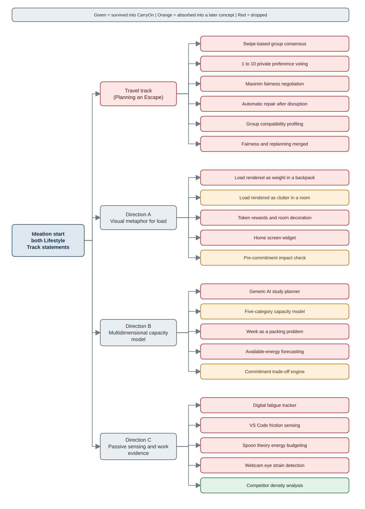
>
> **Mindmap of the divergent brainstorm across both problem statements:** We generated concepts under three headings, a visual metaphor for load, a multidimensional capacity model, and passive sensing of work evidence. The three converged into one concept. The discarded concepts appear here with the reasoning that removed them: spoon theory budgeting, week-as-packing-problem scheduling, energy-budget modelling, digital fatigue tracking and private preference voting.

> 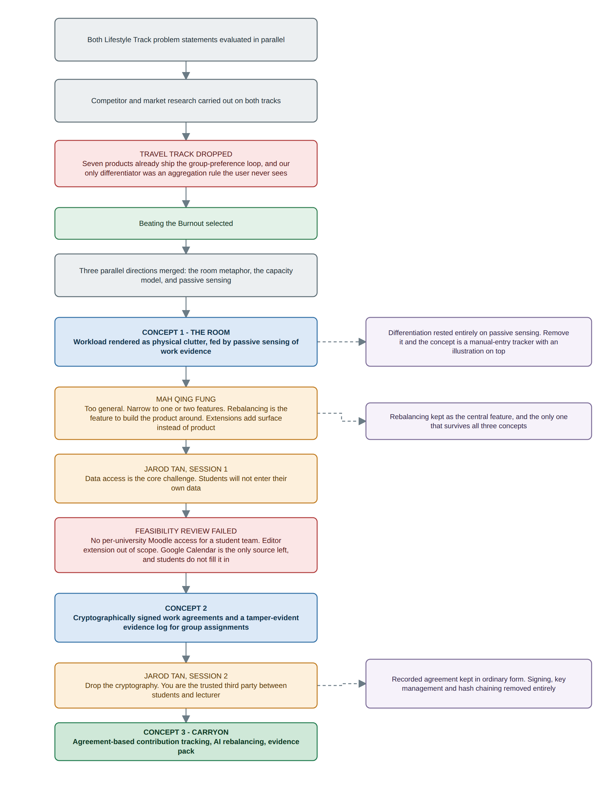
>
> **Concept evolution flowchart with mentor gates:** Two tracks ran in parallel, and one was dropped on competitor research. Three product concepts then followed in sequence with a mentor review between each. It shows what caused each transition instead of only what changed.

**Root cause behind the pivot.** The Room's differentiation rested entirely on passive sensing, and no data source passed feasibility review: a student team cannot obtain per-university LMS access, the editor extension was out of scope, and Google Calendar was the only source left. Our target users do not populate it. Every source we had designed around was either owned by an institution or required manual entry. The rule that follows, and that shapes every integration in CarryOn, is that a data source must be owned directly by the student team.

> 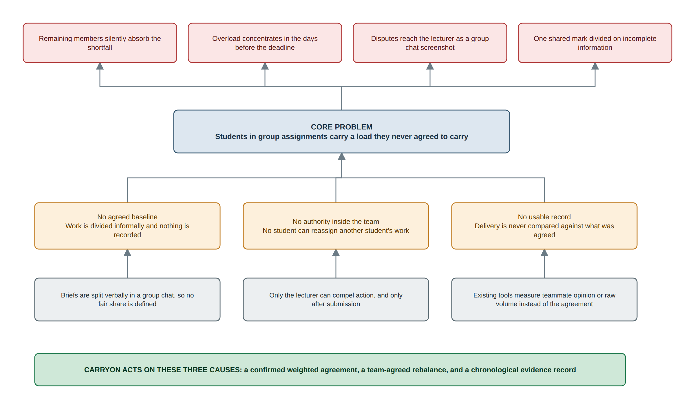
>
> **Problem tree of the causes and effects behind group assignment overload:** Separates the causes we can act on (no agreed baseline, no authority inside the team, no usable record) from the effects we can only observe and shows why we narrowed from five load categories to one specific mechanism.

> 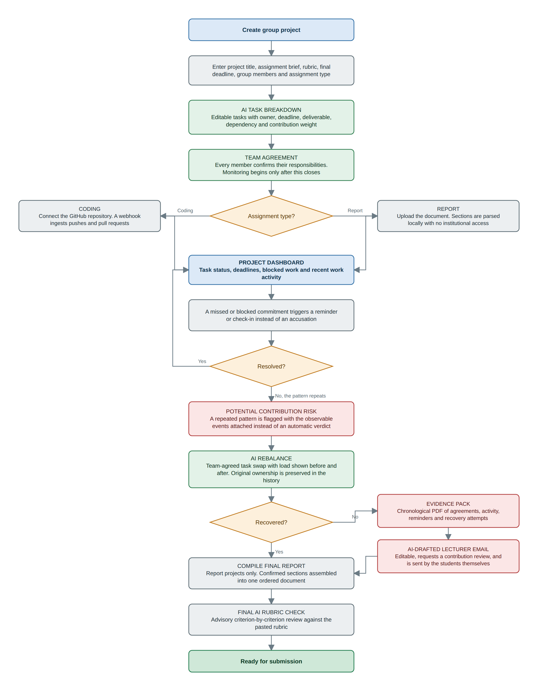
>
> **End-to-end user flow diagram:** The flow runs from setup to submission and branches at three points: assignment type at connection, whether a missed commitment resolves, and whether the team recovers before escalating. The team enters the escalation path on the right only after attempting a rebalance.

### **2.3 Mentor Consultation**

We held three sessions with two mentors. Both mentors reviewed the same original concept independently, which is why two of the changes below have two separate justifications.

| **Date** | **Mentor** | **Feedback Received** | **What Was Changed** |
| --- | --- | --- | --- |
| 2 Sep 2026, 17:00 | Mah Qing Fung | The 67% load figure is not interpretable because the user cannot tell what it means | Removed the abstract percentage entirely. Replaced with an explicit status vocabulary and, on any risk flag, the observable events that caused it |
| 2 Sep 2026, 17:00 | Mah Qing Fung | Focus on one or two main features instead of a broad feature set | Narrowed to three: AI rebalance, evidence pack with drafted email, and report compilation. Everything else is supporting |
| 2 Sep 2026, 17:00 | Mah Qing Fung | Rescheduling and rebalancing is your main feature. Task breakdown is good | Adopted as the product's centre. Both survived the pivot to a different concept and are now FS-09 and FS-02. The product is named after the rebalancing feature |
| 2 Sep 2026, 17:00 | Mah Qing Fung | Do not build an AI chatbot, and do not gamify with tokens | Both accepted. AI is embedded in specific flows with a defined input and output. The product carries no token economy, streaks or rewards |
| 2 Sep 2026, 17:00 | Mah Qing Fung | Extensions and connectors are adding features instead of product. Keep it in one application | Accepted. We removed the VS Code extension and webcam component, and the product became a single interface |
| 2 Sep 2026, 17:00 | Mah Qing Fung | The load tab reads as a to-do list. The room visual tells the user little | Accepted, and it contributed to dropping the metaphor entirely. The dashboard is organised around agreements and evidence instead of a task list |
| 2 Sep 2026, 17:00 | Mah Qing Fung | This reads as too general. Most teams will build something similar | Accepted and escalated. This was the trigger for a full concept review |
| 2 Sep 2026, 17:00 | Mah Qing Fung | Every student has a different capacity. How do you calculate the weight of a piece of work? | Accepted, and it changed the concept's foundation. We stopped trying to infer effort and made contribution weight a team-agreed, editable value. We removed the unsolved measurement problem instead of approximating it |
| 2 Sep 2026, 17:00 | Mah Qing Fung | A home screen widget would be a good addition | **Declined.** Finch, Habitica, Forest, Structured and TickTick all ship one, so it would not have differentiated us, and it required native development alongside the main application |
| 3 Sep 2026, 21:40 | Jarod Tan (session 1) | Data access is your main challenge. The GitHub extension is technically hard, and Moodle will not give you access to each university's data | Accepted. We verified that a student team cannot obtain per-university LMS access, which was decisive since it left Google Calendar as the only remaining source |
| 3 Sep 2026, 21:40 | Jarod Tan (session 1) | Students are lazy about entering assignments. If they do not fill in their calendar, why would they use your app? | Accepted. CarryOn now requires one paste of the brief and rubric at setup, after which evidence accumulates from work the team is already doing in GitHub or in their document |
| 3 Sep 2026, 21:40 | Jarod Tan (session 1) | Target a more specific group | Accepted, and it overrode conflicting advice from Mentor 1, who had suggested broadening. We resolved the disagreement by narrowing further than either version: students in graded group assignments |
| 3 Sep 2026, 21:40 | Jarod Tan (session 1) | Do not let the problem statement blind you. Staying within the theme is enough | Accepted. This gave us permission to change the mechanism while keeping the burnout problem and directly enabled the pivot |
| 3 Sep 2026, 21:40 | Jarod Tan (session 1) | How will you measure the effect? | Partially addressed. Our measurable claim is the number of contribution disputes that reach a lecturer with a chronological record attached instead of a group chat screenshot. We do not claim to measure burnout reduction |
| 4 Sep 2026, 18:50 | Jarod Tan (session 2) | You do not need cryptography. It is used where two parties do not trust each other, as in banking. Here you are the trusted third party between students and lecturers | Accepted in full. We removed all signing, key management and hash chaining. The evidence pack is a generated chronological PDF, and we claim it makes a dispute legible instead of authoritative |
| 4 Sep 2026, 18:50 | Jarod Tan (session 2) | Target lecturers. Consider a closed environment where lecturers monitor how students use AI | **Declined.** It reframes the product as surveillance and serves the institution instead of the students named in the problem statement. The lecturer receives the evidence pack as an external recipient |
| 4 Sep 2026, 18:50 | Jarod Tan (session 2) | Consider an AI agent that evaluates and ranks submissions to assist grading | **Adapted.** We kept the mechanism and changed who it serves. The same rubric evaluation now runs for the student team before submission as advisory feedback, with the lecturer's grading authority untouched |
| 4 Sep 2026, 18:50 | Jarod Tan (session 2) | Use the interface work from the previous concept with the core feature of the new one | Partially accepted. The before-and-after comparison layout from the previous rebalancing screen carried over into the rebalance screen. The room illustration did not, since clutter has no meaning when the subject is a team instead of an individual |

---

## **3. Design & Prototype**

**UI Prototype:** https://carry-on-ochre.vercel.app

> 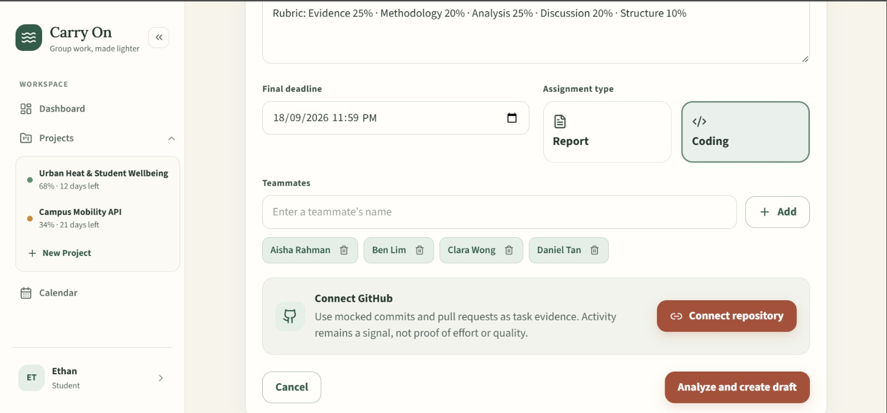
>
> **Project setup:** The team chooses the assignment type here because it determines the downstream branch: GitHub for coding projects, document upload for report projects.

> 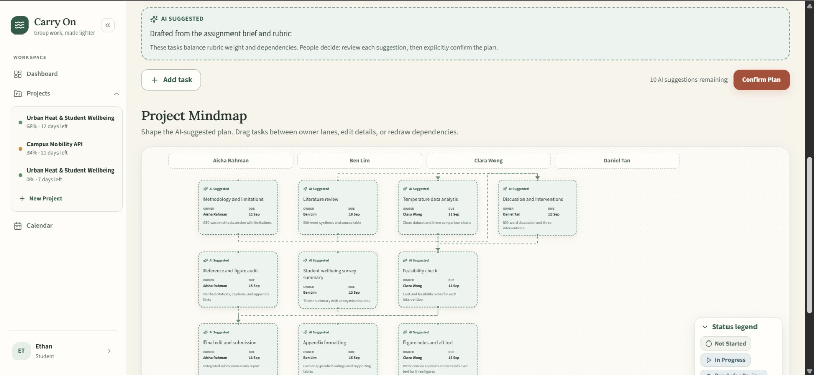
>
> **AI-suggested task plan:** Every field is editable, and the plan is visibly labelled as a suggestion until the team confirms it. The team sets contribution weight here, and it becomes the baseline for everything that follows.

> 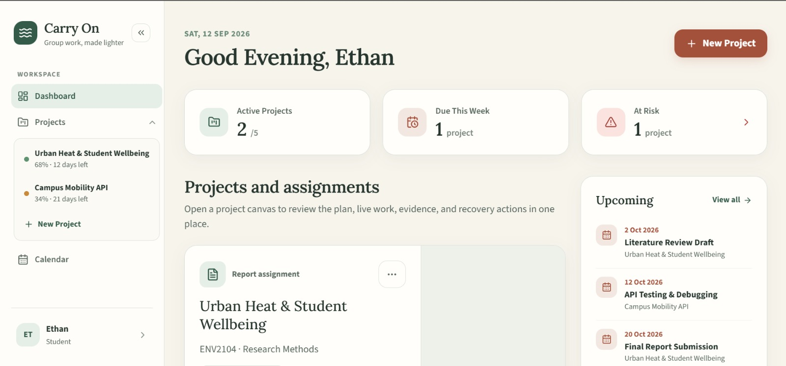
>
> **Project dashboard:** One view carries task ownership, status and recent work activity. Overdue and blocked work are visually distinct from normal in-progress work.

> 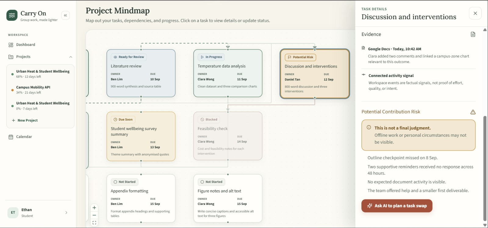
>
> **Potential contribution risk:** The flag never appears without the observable events that caused it, and the primary action is rebalancing instead of escalation.

> 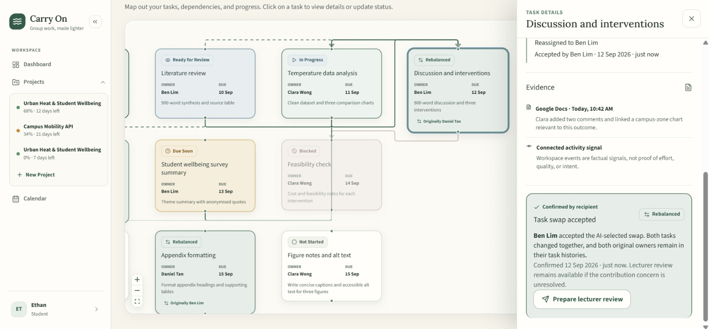
>
> **AI Rebalance:** The screen shows before and after load for every affected member, editable before confirmation. Original ownership is preserved in history instead of overwritten.

> 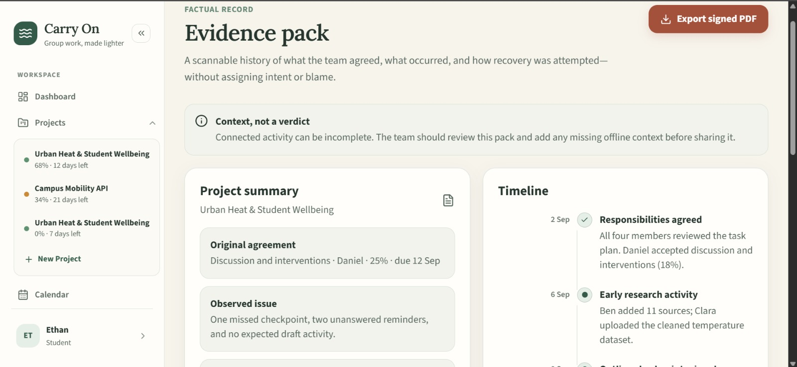
>
> **Evidence pack preview:** The pack is a chronological timeline starting from the agreed responsibilities, and the team reviews it before export.

> 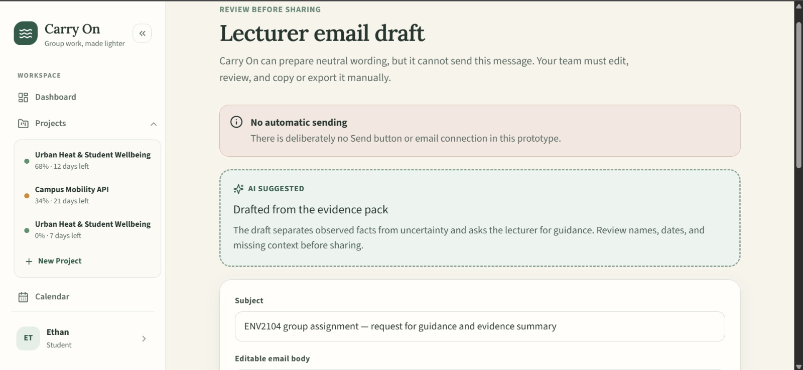
>
> **AI-drafted lecturer email:** The draft is editable, requests an individual contribution review instead of declaring a verdict, and is sent by the students themselves.

---

## **4. What Makes It Different**

**Delivery measured against an agreement instead of an average.** Peer-evaluation and volume-analysis tools compare a member either to their teammates' opinion or to an equal share of total volume. DataScrut's fairness index assumes an equal share, so a member who agreed to handle data collection and diagrams registers as a free rider. CarryOn compares delivery against the weighted responsibility the member confirmed. The rest of the product depends on this comparison, since it makes an uneven but legitimate division of labour readable instead of suspicious.

**Recovery placed between detection and judgement.** Peer evaluation tools detect or grade, and none of them remediate, because their software is not present while the work is happening. In CarryOn the primary output of a contribution risk is a redistributed plan instead of a verdict. Original ownership is preserved in the history.

**Escalation as a student-owned artefact.** Peer evaluation reports to the lecturer who commissioned the survey. CarryOn hands the evidence pack and the email draft to the students and lets them decide whether to send it. We claim it makes a dispute legible and chronological instead of authoritative.

**Proactive task swaps.** A member can request a swap because work turned out to be too difficult or is blocked, and that request is not treated as evidence of contribution risk. This is the path most teams will use, and it is what stops the product becoming an informant.

**Student-owned data sources only.** Every source is one the team controls directly: their own repository, their own documents, their own agreement. This is a design constraint derived from a failure, described in section 2.2, and it is the reason CarryOn can be adopted by four students without the university being involved.

The table below places CarryOn against each competitor category on timing, ownership, and comparison basis.

| Product | Timing | Owner | Compares against |
| --- | --- | --- | --- |
| CATME, Buddycheck, FeedbackFruits | After submission | Instructor | Teammate opinion |
| DataScrut, RepoSense, gitinspector | After submission | Instructor | An assumed equal share of volume |
| Asana, Trello, Notion | During | Team, assuming a manager | Nothing |
| **CarryOn** | During | Students | The agreement the team confirmed |

---

## **5. Technical Architecture & Feasibility**

**Tech stack**

| Layer | Choice | Why | Expected constraint |
| --- | --- | --- | --- |
| Frontend | `Next.js`, hosted on Vercel | Server components suit a dashboard that is mostly reads, and Vercel deploys from the repository with no configuration | Serverless function timeouts make it unsuitable for LLM calls and PDF generation, so all of that work is proxied to the backend |
| Backend | `Python FastAPI`, hosted on Render | The whole document and PDF toolchain is Python, so keeping it in one service avoids a second language | Free tier spins down when idle and cold starts take roughly a minute. We warm the service before any demo |
| Database | Supabase (Postgres) | Managed Postgres with authentication included on the free tier, and the row-level security model fits per-team data isolation | Free projects pause after a period of inactivity, and storage is capped. Agreements and event history are small, so the cap is not a practical limit |
| Work evidence, coding | GitHub webhooks | Push and pull request events arrive automatically, so no polling and no student action is required | Requires a public HTTPS endpoint, which Render provides, plus signature verification on the shared secret. Events only fire for the connected repository, and commit volume is evidence of activity instead of proof of effort |
| Work evidence, report | Document upload parsed with `markitdown` (docx) and `opendataloader-pdf` (pdf) | Local parsing, no API cost, no dependency on institutional access | No live revision history, so a report section is confirmed by teammate review instead of inferred from edit activity. Formatting fidelity varies by source document |
| LLM | Groq API | Fast inference matters because task breakdown runs while the user waits, and the free tier is workable for a demo | Rate and token limits per minute. Breakdown and rubric evaluation are the two heavy calls, so both are cached against the project |
| Report compilation | `docxcompose` | Merges docx files while preserving styles, which is the difficulty in assembling sections written by four people | Requires consistent styles across sections. Mismatched heading styles are the failure mode we expect |
| PDF generation | `WeasyPrint` | The evidence pack is a styled document, and HTML plus CSS lays out the styled page without a drawing API | Needs system libraries on Render, so the build command installs them. The output is a generated PDF and we do not claim it is signed or tamper-proof |
| Email | `mailto` link | Keeps sending under the student's control, which is a product rule instead of a technical shortcut. The product runs no mail server, so there is no deliverability problem and no path to automatic escalation | mailto cannot carry an attachment, so the student downloads the evidence pack and attaches it. The student reviews the pack before sending it |

**Build plan & scope**

We will build one complete path through the product, for one assignment type, and stop.

In scope for the building phase:

1. Project setup with brief and rubric input
2. AI task breakdown into editable tasks with owner, deadline, deliverable and weight
3. Team agreement with per-member confirmation
4. GitHub connection with webhook event ingestion
5. Project dashboard with task status and recent activity
6. Contribution risk flag on a simple, stated rule over missed deadlines and absent activity
7. AI Rebalance with before and after load comparison and team confirmation
8. Evidence pack PDF export with the AI-drafted lecturer email
9. Compile final report for the report branch

Deferred from the build:

- Lecturer accounts and any lecturer-facing dashboard
- Notification delivery. Reminders exist as in-app state only
- Final AI rubric evaluation, if the schedule tightens. It is separable from the rest of the build and outside our central claim
- A tuned risk model. The build ships a rule with stated thresholds instead of a learned one
- Mobile applications. The product is responsive web only

We are a four-person team building alongside coursework. The scope above is one flow, one assignment branch fully working and the second branch partially, and three third-party integrations we do not have to build ourselves.
